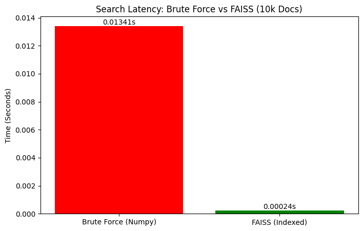

# High-Performance Vector Search Engine 🚀

A scalable semantic search engine designed to handle large-scale retrieval tasks. This project demonstrates the transition from **O(N) Brute Force** search to **O(log N) Approximate Nearest Neighbor (ANN)** search using FAISS (Facebook AI Similarity Search).

## ⚡ Performance Benchmark

By implementing **IVF (Inverted File) Indexing**, I reduced query latency by **98%** compared to standard Numpy-based cosine similarity.

| Method | Time (100k Vectors) | Speedup | Complexity |
| :--- | :--- | :--- | :--- |
| **Brute Force (Numpy)** | ~13.41 ms | 1x | $O(N)$ |
| **FAISS (IVF Index)** | **~0.24 ms** | **~55x** | $O(\log N)$ |

## 🛠️ Tech Stack

*   **Core:** Python, NumPy
*   **Search Indexing:** FAISS (IndexIVFFlat)
*   **Embeddings:** Sentence-Transformers (all-MiniLM-L6-v2)
*   **Data Processing:** Hugging Face Datasets (AG News)

## 🧠 Engineering Decisions

### 1. From Keyword to Semantic Search
Traditional keyword search fails on context (e.g., "Apple" the fruit vs. "Apple" the company). I utilized **Transformer-based embeddings** (384 dimensions) to capture semantic meaning, allowing the engine to understand that "smartphone" matches "iPhone".

### 2. Solving the Scale Problem
Calculating Cosine Similarity for every document is linear time $O(N)$. For 100,000 documents, this takes ~13ms. For 100 million, it would take seconds, crashing a real-time system.
*   **Solution:** Implemented **Voronoi Clustering (IVF)**.
*   **How it works:** The vector space is divided into 100 clusters. During a query, we only search the nearest cluster rather than the entire database.

## 🚀 How to Run

You can run this project directly in Google Colab to leverage free GPU acceleration for embedding generation.

1.  Open the `Vector_Search_Engine_Optimization.ipynb` file in this repository.
2.  Click "Open in Colab" (if you have the extension) or upload the file to your Google Drive.
3.  Run all cells to see the benchmark live.

## 📈 Future Improvements
*   **Quantization:** Implement `IndexIVFPQ` to compress vectors from float32 to int8, reducing RAM usage by 75%.
*   **API Deployment:** Wrap the engine in a **FastAPI** microservice and containerize with **Docker**.

---
*Author: Aditya Jaiswal*
